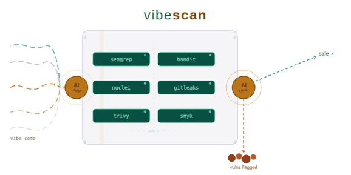

<div align="center">



# vibescan

### Security Scanner for Vibe-Coded Software

**Scan AI-generated code for vulnerabilities before they ship.**

[](https://opensource.org/licenses/MIT)
[](https://golang.org)
[](https://github.com/Armur-Ai/vibescan)
[](https://discord.gg/PEycrqvd)

[Quick Start](#quick-start) &bull; [Interactive TUI](#interactive-tui) &bull; [Features](#features) &bull; [Languages](#supported-languages) &bull; [CLI Reference](#all-commands) &bull; [CI/CD](#cicd-integration) &bull; [MCP](#ai-editor-integration-mcp) &bull; [Contributing](#contributing)

</div>

---

Vibecoding is fast. But AI-generated code ships vulnerabilities you didn't write and don't understand.

**vibescan** catches them. It runs 30+ security tools, builds your app in a sandbox, simulates real attacks, maps exploit chains, and reviews every PR — all from a single interactive terminal UI.

## Quick Start

**Install** (pick one):

```bash
# macOS / Linux
brew install vibescan-ai/tap/vibescan

# npm (any platform)
npm install -g @vibescan/cli

# pip
pip install vibescan

# Direct download
curl -fsSL https://install.vibescan.dev | sh
```

**Then just run it:**

```bash
vibescan
```

That's it. No flags, no config. vibescan launches a full-screen interactive menu:

```
              V I B E S C A N
     Security Scanner for Vibe-Coded Software
  SAST  +  DAST  +  Exploit Simulation  +  Attack Paths

────────────────────────────────────────────────────────

  What would you like to do?

  ▸ 🔍 Scan Project          Analyze your code for vulnerabilities
    🖥  Interactive Scan       Guided wizard with live dashboard
    📋 Review Pull Request    Security review a GitHub/GitLab PR
    📊 View History           Browse past scan results
    📄 Generate Report        Create HTML, CSV, OWASP reports
    💡 Explain Finding        Get an AI explanation
    🔧 Fix Finding            Generate an AI-powered code patch
    🩺 Check Health           Verify tools and configuration
    ⚙  Initialize Project     Create .vibescan.yml config
    🔌 Setup AI / MCP         Configure editor integration

────────────────────────────────────────────────────────
  ↑↓ navigate  enter select  q quit
```

Navigate with arrow keys, press Enter to select. Every action is one keypress away.

## Interactive TUI

### Scan Flow

Select **"Scan Project"** and vibescan walks you through a 4-step wizard:

```
  VIBESCAN — Scan Configuration
  ● Target  →  ○ Language  →  ○ Depth  →  ○ Confirm

────────────────────────────────────────────────────────

  What would you like to scan?

  ● Current directory (my-project)
  ○ Enter a different path
  ○ Scan a remote repository

────────────────────────────────────────────────────────
  ↑↓ navigate  enter select  backspace back  esc cancel
```

After confirming, you get a **live dashboard** showing every tool's progress in real time:

```
╔══════════════════════════════════════════════════════╗
║  VIBESCAN  ·  ./my-project  ·  GO  ·  deep scan     ║
╠══════════════════════════════════════════════════════╣
║  Tool              Status          Found             ║
║  ──────────────────────────────────────────────────  ║
║  ✓ semgrep         completed 4s      14              ║
║  ⟳ gosec           running 2s         3              ║
║  ○ staticcheck     queued             -              ║
║  ○ gocyclo         queued             -              ║
║  ○ trufflehog      queued             -              ║
╠══════════════════════════════════════════════════════╣
║  Critical: 0  High: 3  Medium: 8  Low: 6  Info: 0  ║
║  Elapsed: 0:06                           [q] Quit   ║
╚══════════════════════════════════════════════════════╝
```

When the scan completes, you enter the **results browser** — a two-pane interactive viewer:

```
  17 findings · Showing: all · [f] filter · [↑↓/jk] navigate · [q] quit

  SEV       FILE                          LINE   MESSAGE
  ─────────────────────────────────────────────────────────────────
  [CRIT]    internal/handlers.go           42    SQL injection via user input
▸ [HIGH]    internal/auth.go              118    Hardcoded JWT secret
  [HIGH]    pkg/api/client.go              67    TLS verification disabled
  [ MED]    cmd/server/main.go             23    Missing CORS configuration
  [ LOW]    internal/utils.go             156    Unused error return

  ────────────────────────────────────────────────────────────────
  File:     internal/auth.go:118
  Severity: [HIGH]
  Rule:     gosec.G101
  CWE:      CWE-798
  Tool:     gosec
  Message:  Hardcoded credentials: JWT secret stored as string literal
```

Press `f` to filter by severity, `j/k` to navigate, `q` to quit.

### Direct Commands

Prefer flags over TUI? Everything works non-interactively too:

```bash
# Quick scan
vibescan scan .

# Deep scan with all tools
vibescan scan . --advanced

# Scan a GitHub repo
vibescan scan https://github.com/owner/repo -l go

# SARIF output for CI
vibescan scan . --format sarif --fail-on-severity high

# Watch mode — re-scan on file changes
vibescan scan . --watch
```

## Features

| Feature | What it does |
|---------|-------------|
| **SAST** | 30+ tools across 15 languages. Findings deduplicated, severity-normalized. |
| **DAST** | Auto-builds sandbox from your code, runs passive + active security tests. |
| **Exploit Simulation** | Generates PoC exploits (SQLi, XSS, RCE, SSRF) and runs them in sandbox. |
| **Attack Paths** | Chains findings into attack graphs with Mermaid visualization. |
| **PR Review** | `vibescan review <pr-url>` — SAST + secrets + DAST on the diff. |
| **AI Explain/Fix** | `vibescan explain` and `vibescan fix` powered by Claude or Ollama. |
| **MCP Server** | Works inside Claude Code, Cursor, Windsurf via MCP protocol. |
| **SCA** | Every package ecosystem: npm, pip, Go, Cargo, Maven, Ruby, PHP, NuGet, etc. |
| **Secrets** | Gitleaks + Trufflehog with git history scanning and secret validation. |
| **IaC** | Terraform, Kubernetes, Docker, Ansible, Helm — checkov, tfsec, kube-linter. |
| **Compliance** | OWASP Top 10, CWE Top 25, PCI-DSS, HIPAA, NIST mapping. |
| **Reports** | HTML, CSV, SARIF, OWASP, SANS — all from `vibescan report`. |

## Supported Languages

| Language | Tools | Categories |
|----------|-------|------------|
| **Go** | semgrep, gosec, govet, staticcheck, gocyclo, govulncheck | SAST, SCA, Quality |
| **Python** | semgrep, bandit, pylint, radon, pydocstyle, pip-audit | SAST, SCA, Quality |
| **JavaScript/TS** | semgrep, eslint | SAST, Quality |
| **Rust** | semgrep, cargo-audit, cargo-geiger, clippy | SAST, SCA |
| **Java/Kotlin** | semgrep, spotbugs, pmd, dependency-check | SAST, SCA |
| **Ruby** | semgrep, brakeman, bundler-audit | SAST, SCA |
| **PHP** | semgrep, phpcs, psalm | SAST, Quality |
| **C/C++** | semgrep, cppcheck, flawfinder | SAST |
| **C#/.NET** | semgrep, security-code-scan, roslynator | SAST, Quality |
| **Solidity** | semgrep, slither, mythril | SAST |
| **IaC** | checkov, hadolint, tfsec, kics, kube-linter, kube-score, terrascan | IaC |
| **Containers** | trivy, grype | SCA, Image |
| **Secrets** | trufflehog, gitleaks | Secrets |
| **Shell** | shellcheck | SAST |
| **Swift** | swiftlint | SAST |

## All Commands

| Command | Description |
|---------|-------------|
| `vibescan` | **Launch interactive TUI** (default when no args) |
| `vibescan scan <target>` | One-shot scan with flags |
| `vibescan run` | Guided wizard → live dashboard → results browser |
| `vibescan review <pr-url>` | Review a GitHub/GitLab pull request |
| `vibescan explain <id>` | AI explanation of a finding |
| `vibescan fix <id>` | AI-generated code patch |
| `vibescan serve` | Start the embedded API server |
| `vibescan doctor` | Check which tools are installed |
| `vibescan init` | Create `.vibescan.yml` config file |
| `vibescan history` | List past scans |
| `vibescan compare <id1> <id2>` | Diff two scan results |
| `vibescan report` | Generate HTML/CSV/OWASP/SANS reports (interactive) |
| `vibescan mcp` | Start MCP server for AI editors |
| `vibescan quickstart` | Step-by-step getting started guide |
| `vibescan completion <shell>` | Shell completions (bash/zsh/fish/powershell) |
| `vibescan version` | Print version info |

## CI/CD Integration

### GitHub Actions

```yaml
- name: vibescan Security Scan
  run: |
    curl -fsSL https://install.vibescan.dev | sh
    vibescan scan . --format sarif --output results.sarif --fail-on-severity high
- uses: github/codeql-action/upload-sarif@v3
  if: always()
  with:
    sarif_file: results.sarif
```

### GitLab CI

```yaml
vibescan:
  image: vibescan/agent:latest
  script:
    - vibescan scan . --format sarif --output gl-sast-report.json --fail-on-severity high
  artifacts:
    reports:
      sast: gl-sast-report.json
```

See also: [CircleCI](docs/ci/circleci.md), [Jenkins](docs/ci/jenkins.md), [Azure DevOps](docs/ci/), [Bitbucket](docs/ci/)

## AI Editor Integration (MCP)

vibescan runs as an MCP server inside Claude Code, Cursor, and Windsurf:

```bash
# Claude Code
claude mcp add vibescan -- vibescan mcp

# Cursor — add to ~/.cursor/mcp.json:
# { "mcpServers": { "vibescan": { "command": "vibescan", "args": ["mcp"] } } }
```

MCP tools available to your AI assistant:
- `vibescan_scan_path` — scan a directory
- `vibescan_scan_code` — scan a code snippet inline
- `vibescan_check_dependency` — check a package for CVEs
- `vibescan_explain_finding` — explain a vulnerability
- `vibescan_get_history` — recent scan history

## Configuration

Create `.vibescan.yml` in your project root (or run `vibescan init`):

```yaml
scan:
  depth: quick                  # quick | deep
  severity-threshold: medium    # minimum severity to report
  fail-on-findings: true        # exit code 1 in CI

exclude:
  - vendor/
  - node_modules/
  - testdata/

tools:
  disabled:
    - gocyclo                   # skip specific tools
```

Full reference: [Configuration docs](docs/configuration/armur-yml.md)

## Architecture

```
                   ┌────────────────┐
                   │  vibescan CLI  │  (Cobra + Bubbletea TUI)
                   └──────┬─────────┘
                          │
                ┌─────────▼──────────┐
                │   API Server (Gin) │  port 4500
                └─────────┬──────────┘
                          │
              ┌───────────▼────────────┐
              │  Asynq Worker (Redis)  │
              └───────────┬────────────┘
                          │
         ┌────────────────▼─────────────────┐
         │        Tool Runners (30+)         │
         │  semgrep, gosec, bandit, eslint,  │
         │  trivy, gitleaks, slither, ...    │
         └────────────────┬─────────────────┘
                          │
              ┌───────────▼────────────┐
              │  Finding Pipeline       │
              │  Normalize → Dedup →    │
              │  Fingerprint → Score    │
              └───────────┬────────────┘
                          │
         ┌────────────────▼─────────────────┐
         │   Output: TUI, Text, JSON,       │
         │   SARIF, HTML, CSV, OWASP        │
         └──────────────────────────────────┘
```

## Self-Hosted (Docker)

```bash
docker-compose up -d

curl -X POST http://localhost:4500/api/v1/scan/repo \
  -H "Content-Type: application/json" \
  -d '{"repository_url": "https://github.com/owner/repo", "language": "go"}'
```

API docs: `http://localhost:4500/swagger/index.html`

## Security

Found a vulnerability in vibescan? See [SECURITY.md](SECURITY.md) for responsible disclosure.

## Contributing

Contributions welcome! See [CONTRIBUTING.md](CONTRIBUTING.md) for how to add tools, languages, and rules.

## Roadmap

See [IMPROVEMENTS.md](IMPROVEMENTS.md) — 59 sprints across 7 phases, from core product to distributed scanning.

## License

MIT — see [LICENSE](LICENSE).

---

<div align="center">

**[vibescan.dev](https://vibescan.dev)** &bull; [Discord](https://discord.gg/PEycrqvd) &bull; [Docs](docs/)

*Built for the vibecoding era. Ship fast, ship safe.*

</div>
